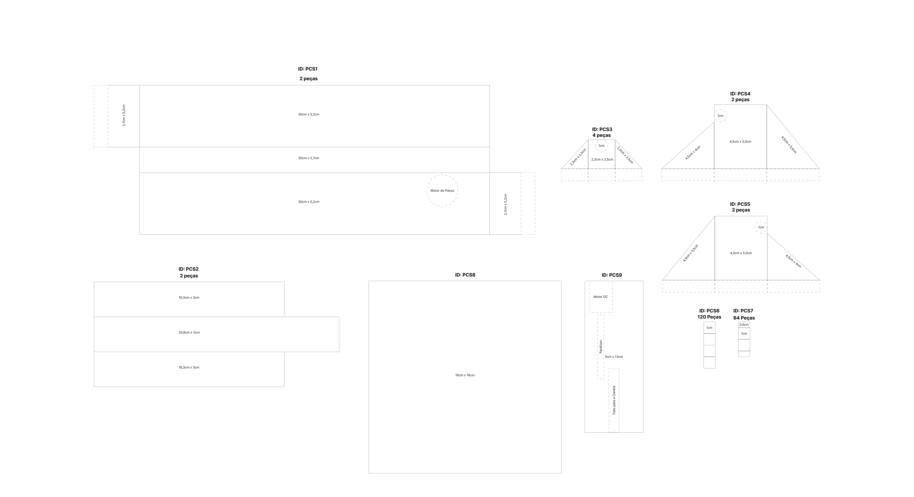
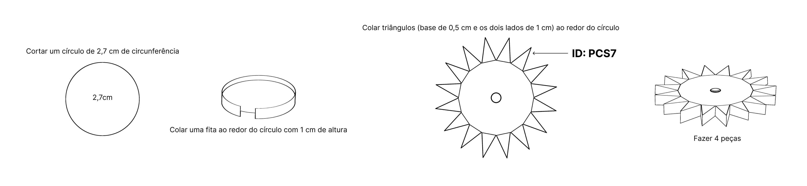
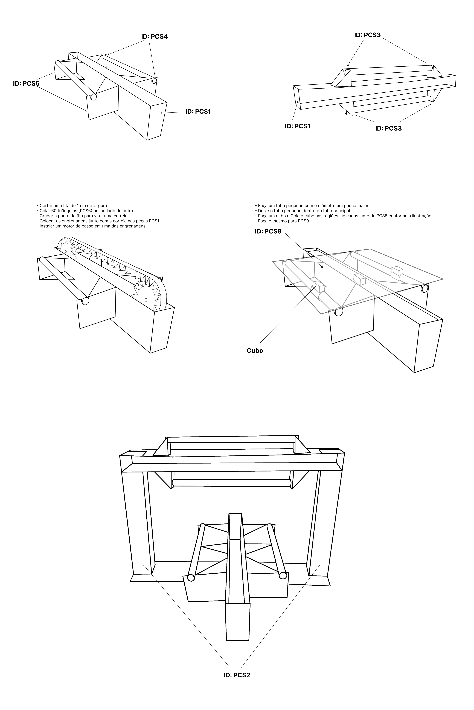
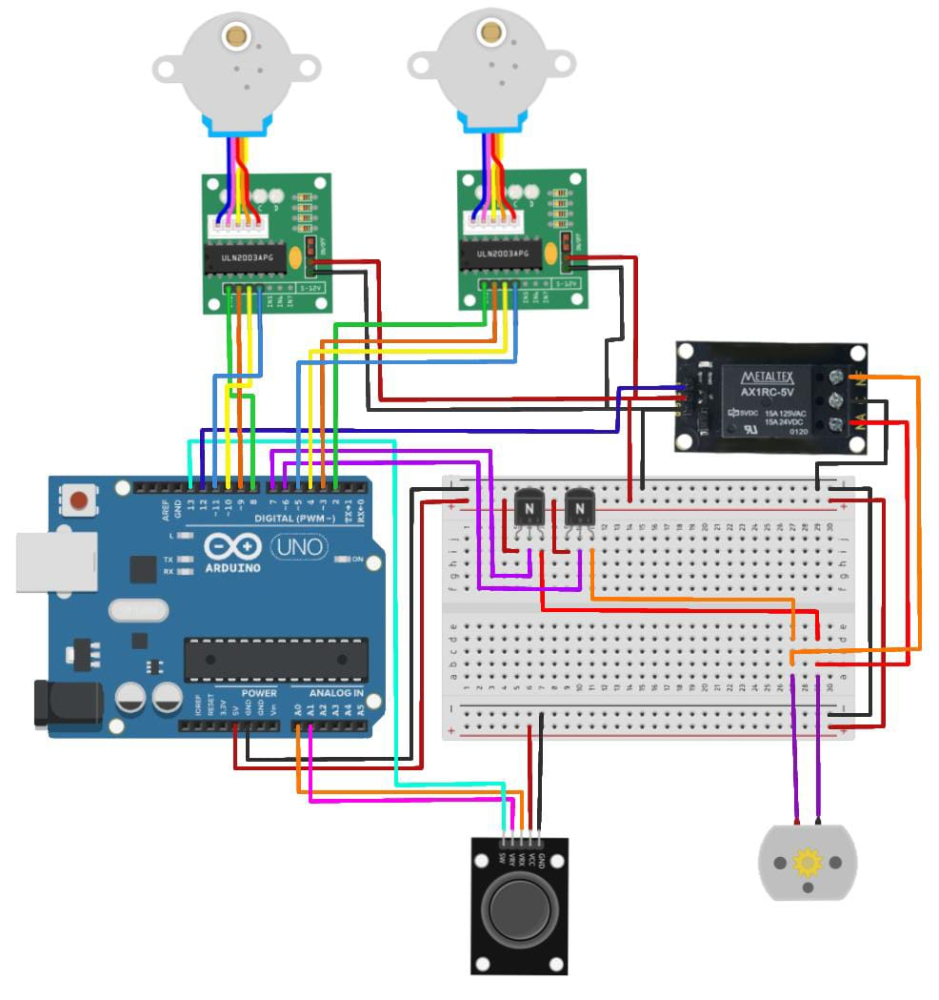

# 2D Printer Arduino

## Sobre
Este repositório contém o código e a documentação de uma **impressora 2D** feita a partir de papelão e papel, utilizando Arduino e diversos componentes eletrônicos. O projeto foi desenvolvido por mim para explorar o controle preciso de motores e a integração de diferentes módulos, resultando em um sistema funcional e de baixo custo para desenho em duas dimensões.

## Tecnologias utilizadas
- C++

## Montagem do Projeto
### Impressora 2D
Abaixo estão as etapas de montagem e os arquivos necessários para construir a impressora 2D:
### 1. Molde da Impressora
[Ver Molde](Montagem_da_impressora/1.png)
 

### 2. Engrenagens
[Ver Engrenagens](Montagem_da_impressora/2.png)
 

### 3. Montagem Final
[Ver Montagem](Montagem_da_impressora/3.png)
 

## Componentes

| Componente                 | Quantidade | Descrição                                                 |
|----------------------------|------------|-----------------------------------------------------------|
| Motor de passo             | 2          | Motores de passo para controle preciso de movimento.      |
| Módulo para motor de passo | 2          | Controladores dos motores de passo.                       |
| Transistor                 | 2          | Transistores para controle de alta corrente.              |
| Motor DC                   | 1          | Motor de corrente contínua.                               |
| Joystick KY-023            | 1          | Controle de movimento bidirecional com botão embutido.    |
| Relé                       | 1          | Interruptor controlado eletronicamente para cargas altas. |
| Microcontrolador Arduino   | 1          | Plataforma de desenvolvimento para controle do sistema.   |
| Protoboard                 | 1          | Placa de ensaio para montagem dos componentes.            |

## Código

Você pode acessar o código-fonte completo do projeto no arquivo **Impressora_2D.ino**:
- [Código do Projeto](Impressora_2D/Impressora_2D.ino)

## Visual do Projeto
